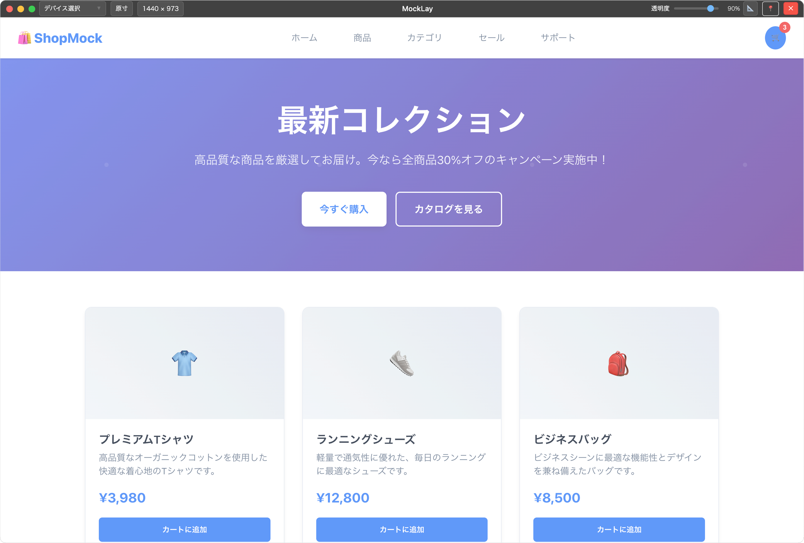

# mocklay-releases

# MockLay

MockLay は、デザインの校正・チェック作業をサポートするアプリケーションです。画像を半透明のオーバーレイとして表示し、ブラウザやアプリ上のコンテンツと比較しながらデザインの確認を行うことができます。

## 主な機能

### 📸 画像オーバーレイ表示

- 画像をドラッグ&ドロップで簡単に読み込み
- 半透明表示でブラウザ画面やデバッグ画面と重ねて比較
- 透明度の調整（20%〜100%）

### 🔧 表示制御

- **ウィンドウサイズ調整**: 手動でのサイズ変更に対応
- **スケール調整**: 画像の拡大・縮小
- **配置調整**: 画像の位置を細かく調整（9 つのアンカーポイント + オフセット）
- **元サイズ復元**: ワンクリックで画像の元サイズに戻す

### 📜 履歴機能

- 最近使用した画像の履歴を保存
- 履歴から素早く画像を再読み込み

### 🎯 ウィンドウ制御

- 常に最前面表示
- 画像なしの状態ではウィンドウ位置固定
- タイトルバーの最小化・閉じるボタン

## システム要件

- **OS**: macOS, Windows

## 基本的な使い方

### 1. 画像の読み込み

1. MockLay を起動
2. メインウィンドウに画像ファイル（PNG、JPG、GIF 等）をドラッグ&ドロップ
3. 画像が読み込まれ、ウィンドウサイズが自動調整されます

### 2. 比較作業

1. ブラウザで比較したいウェブページを開く
2. MockLay のウィンドウをブラウザ上に配置
3. 透明度や位置を調整してデザインと比較

### 3. 表示調整

#### 透明度の調整

- タイトルバーの透明度スライダーで調整（20%〜100%）

#### サイズ調整

- **手動調整**: サイズ入力フィールドで幅・高さを直接指定
- **元サイズ復元**: 「元サイズ」ボタンで画像の元サイズに戻す

#### スケール調整

- スケール機能を有効にしてスライダーで拡大・縮小

#### 位置調整

- 9 つのアンカーポイント（上左、上中央、上右など）から基準点を選択
- 各方向のオフセット値で微調整

### 4. 履歴機能

- 過去に使用した画像は履歴に保存されます
- メイン画面下部の履歴一覧から再度読み込み可能

## 権利情報

Copyright © 2025 adenohitu. All rights reserved.
